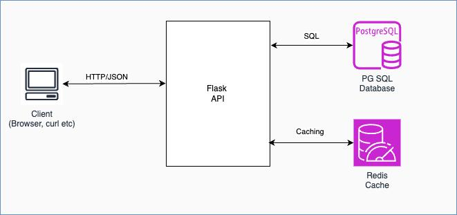

# Flask API with PostgreSQL

## Introduction

This project is a Flask-based web API that connects to a PostgreSQL database. The API provides endpoints to retrieve average pricing data between ports or regions. The project is containerized using Docker and managed with Docker Compose.
### Key Features
1. API Endpoint: Supports querying average prices between ports or regions over a specified date range.
2. Caching with Redis: Caches SQL query results in Redis, reducing the need to repeatedly hit the PostgreSQL database for the same queries.
3. Dockerized Setup: The application, PostgreSQL database, and Redis cache are all containerized using Docker and Docker Compose, making it easy to set up and deploy.

### Application overview

## Build / Run / Testing

### Pre-requisites 
1. **Ensure Docker and Docker Compose are installed** on your machine. You can download Docker from [Docker's official site](https://www.docker.com/products/docker-desktop) and Docker Compose from [here](https://docs.docker.com/compose/install/).
2. Install Make, optionally to run the commands easily [GNU-Make](https://www.gnu.org/software/make/manual/make.html)


### Build
To build the Docker images for this project, follow these steps:


1. **Clone the repository:**

    ```bash
    git clone https://github.com/panchami-ks1/rates-service.git
    cd your-repository
    ```

2. **Build the Docker images:**

    ```bash
    make build
    ```
   If make is not available, run the following command.
    ```bash
    docker-compose build
    ```

### Run

To start the application and the PostgreSQL database.

1. **Start the containers:**

    ```bash
    make run
    ```
   If make is not available, run the following command.
    ```bash
    docker-compose up -d
    ```
2. **Access the Flask API:** 

    The Flask application will be available at [http://localhost:8080/rates](http://localhost:8080/rates).
3. **Sample Request/Response** 

    ```
    curl --location 'http://127.0.0.1:8080/rates?date_from=2016-01-01&date_to=2016-01-10&origin=CNSGH&destination=north_europe_main'
    ```
   
   ```
       [
          {
              "average_price": "1112",
              "day": "2016-01-01"
          },
          {
              "average_price": "1112",
              "day": "2016-01-02"
          },
          {
              "average_price": null,
              "day": "2016-01-03"
          },
          {
              "average_price": null,
              "day": "2016-01-04"
          },
          {
              "average_price": "1142",
              "day": "2016-01-05"
          },
         ...
      ]
    ```

### Stop

To stop the application and the PostgreSQL database.

1. **Stop the containers:**

    ```bash
    make stop
    ```
   If make is not available, run the following command.
    ```bash
    docker-compose down
    ```
      
### Test

To run the tests for this project, follow these steps:

1. **Run the tests:**

    ```bash
    make test
    ```
   If make is not available, run the following command.
    ```bash
    docker-compose run test
    ```

## References

- [Flask Documentation](https://flask.palletsprojects.com/en/2.2.x/)
- [PostgreSQL Documentation](https://www.postgresql.org/docs/)
- [Docker Documentation](https://docs.docker.com/)
- [Docker Compose Documentation](https://docs.docker.com/compose/)
- [pytest Documentation](https://docs.pytest.org/en/stable/)
- [Recursive PostgresSQL](https://elvisciotti.medium.com/postgresql-recursive-query-the-simplest-example-explained-f9b85e0a371b)

